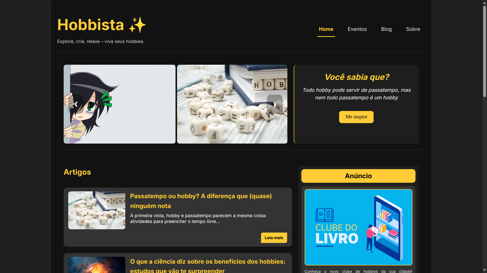

# 🌟 Hobbista

**Hobbista** é um guia digital feito para ajudar você a **descobrir, explorar e valorizar hobbies**.  
Acreditamos no poder das atividades criativas para melhorar o bem-estar, aliviar o estresse e conectar você com suas paixões.

Seja criando, assistindo, jogando ou compartilhando, os hobbies tornam a vida mais leve e divertida — e o Hobbista está aqui para te inspirar nessa jornada.

🔗 Acesse o site: [https://hobbista.vercel.app](https://hobbista.vercel.app)

---

## 📸 Captura de Tela

  

---

## 📚 Sobre o Projeto

Este site foi desenvolvido como parte de um projeto avaliativo da disciplina **Desenho de Páginas Web**.  
O objetivo era criar uma página completa utilizando **HTML, CSS e JavaScript puros**, aplicando conceitos básicos de criação de páginas web e aprender a hospedar um site na web.

---

## 🛠️ Tecnologias Utilizadas

- **HTML5** – Estrutura semântica e acessível
- **CSS3** – Estilização moderna e responsiva
- **JavaScript** – Funcionalidades básicas e interativas
- **Vercel** – Plataforma de hospedagem gratuita e rápida

---

## ✨ Funcionalidades

- Navegação clara com **menu interativo**
- **Slideshow** com destaques sobre hobbies
- Sessão de **artigos e eventos**
- Área dedicada a **patrocinadores e apoiadores**

---

## 📁 Organização dos Arquivos

```bash
hobbista/
├── blog.html
├── eventos.html
├── index.html
├── sobre.html
├── README.html
├── /css/
│   ├── ads.css
│   ├── base.css
│   ├── blog.css
│   ├── hero.css
│   ├── patronos.css
│   └── sobre.css
├── /js/
│   ├── contact-form.js
│   └── hero.js
├── /img/
│   └── imagens e ícones
└── /blog/
    └── artigos
